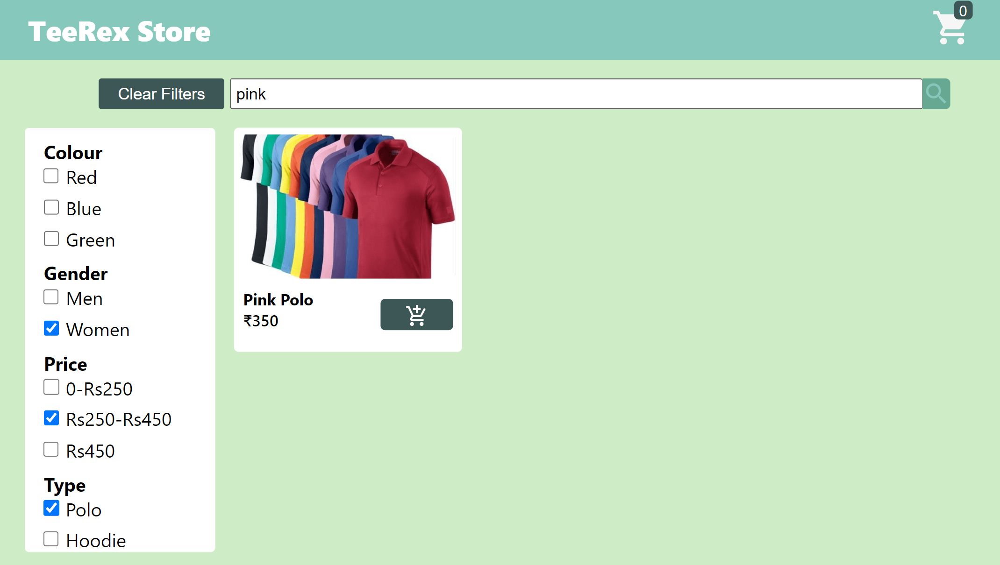
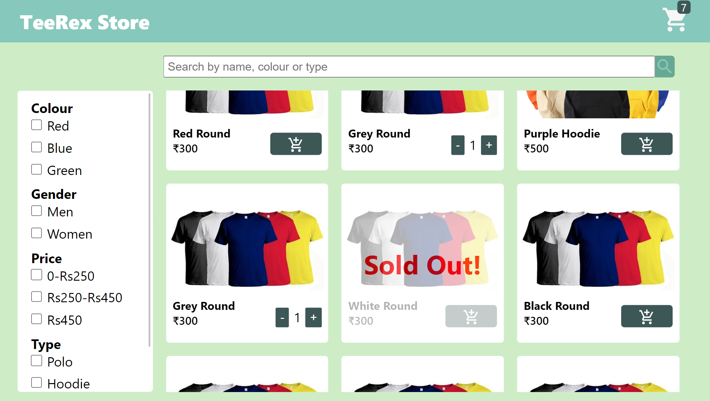
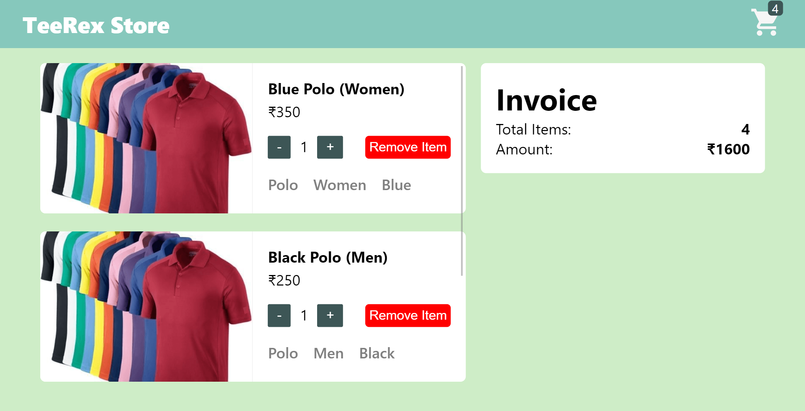
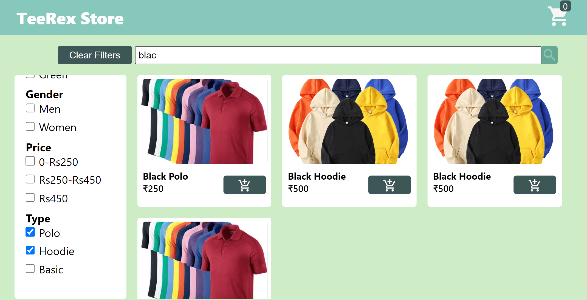
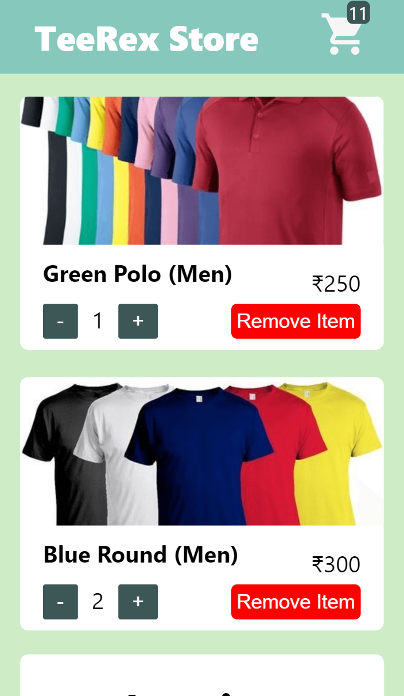
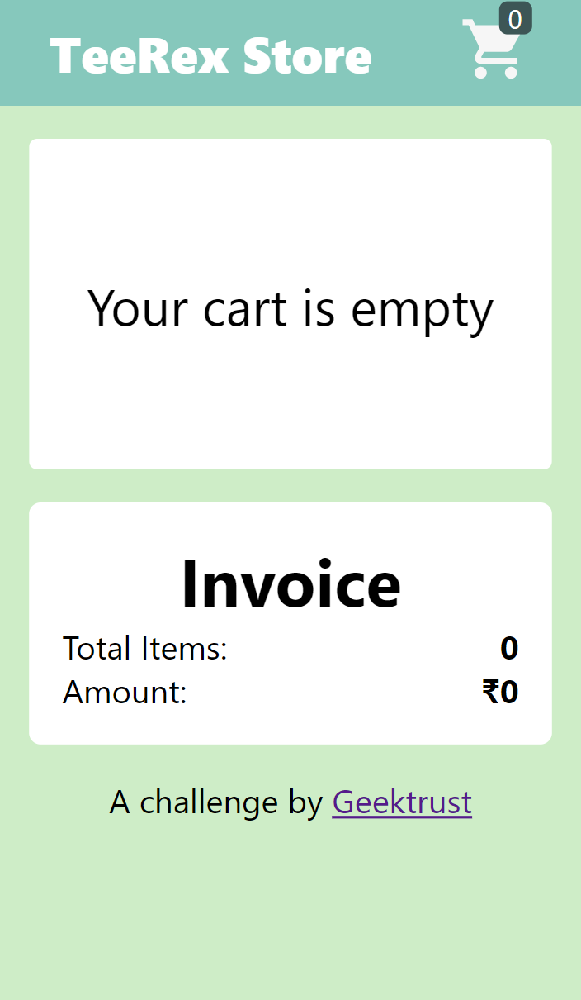
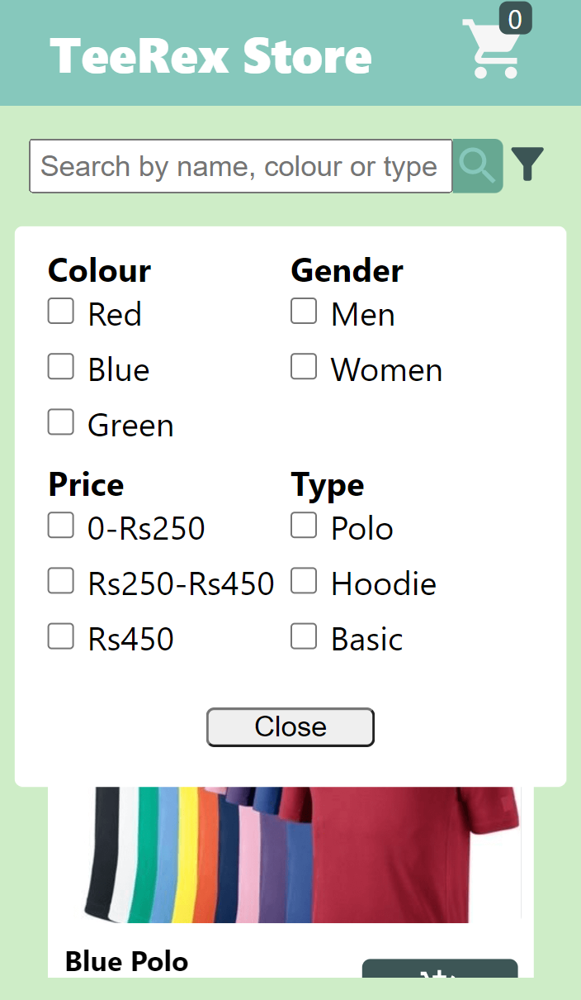
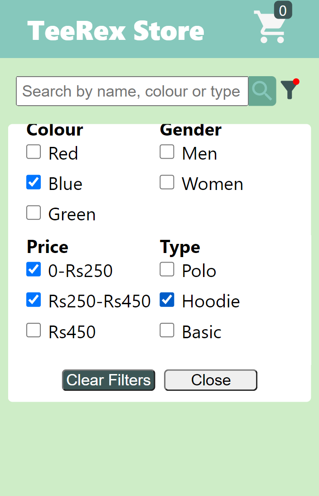

# TeeRex Store

This project is a frontend challenge by **[Geektrust](https://www.geektrust.com)**.
- I have used **React 18** as the frontend library.
- The icons that I used are taken from **[Material Icons](https://mui.com/material-ui/material-icons/)**.
- I have used **React's Context API** for holding the state of cart items and total items in the cart.
- I also used a custom hook to keep track of window width for implementing mobile and desktop filters.
- I have tried my best to keep the components and functions clean and modular.

To view the live url of the site click here - **[Live Site](https://teerex-store-geektrust-rp0706.netlify.app/)**  

*The deployment is done using **[Netlify](https://www.netlify.com/)***

## Some screenshots of the project
### Desktop view
<figure>
    
         &nbsp;&nbsp;
    
</figure>
<figure>
    
         &nbsp;&nbsp;
    
</figure>

### Mobile view
<figure>
    
         &nbsp;&nbsp;
    
         &nbsp;&nbsp;
    
         &nbsp;&nbsp;
    
</figure>

